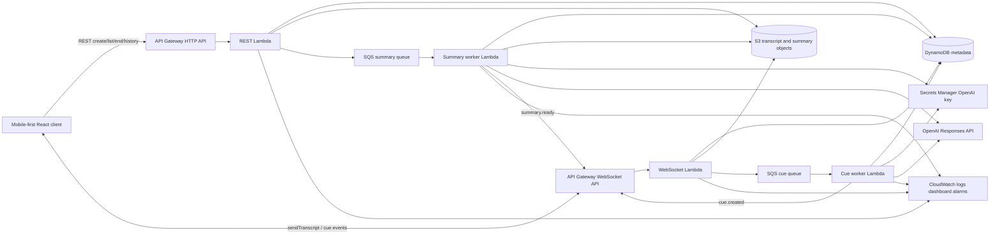
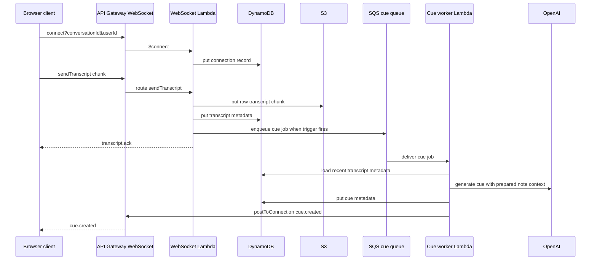

# CueFlow Architecture

CueFlow is a mobile-first conversation intelligence MVP. A user starts a live session, sends transcript chunks, receives AI cue cards through a real-time channel, ends the session, and views a structured conversation summary and history.

## Tiers

Presentation tier:
- React + Vite web client.
- Mobile-first live conversation, cue list, transcript, summary, and history views.
- Hosted from S3 through CloudFront in AWS by default, with an API Gateway HTTPS static frontend fallback for restricted Learner Lab accounts.

API and edge tier:
- API Gateway HTTP API for conversation lifecycle, history, cue listing, and summary retrieval.
- API Gateway WebSocket API for real-time transcript input, transcript acknowledgements, and cue delivery.
- CORS and API Gateway throttling are the first edge controls.

Application tier:
- Lambda REST handler for create/list/get/end/summary operations.
- Lambda WebSocket handler for connect, disconnect, sendTranscript, ping, and clientAckCue routes.
- SQS-backed cue worker and summary worker.
- AI provider abstraction. The deployed path uses OpenAI through Lambda/worker code with the key read from Secrets Manager; deterministic mock AI remains available for local unit tests.

Data tier:
- DynamoDB single-table metadata model for conversations, transcript chunk metadata, cues, and WebSocket connection state.
- S3 data bucket for raw transcript chunks, full transcript objects, and summary objects.

Observability and DevOps tier:
- Structured JSON logs from handlers and workers.
- CloudWatch metrics, dashboard, and alarms.
- AWS CDK for all cloud resources.
- GitHub Actions for test, build, synth, and optional deploy.

## Request Flow

Conversation start:
1. Client calls `POST /conversations`.
2. REST Lambda creates an ACTIVE conversation metadata item.
3. Client connects to WebSocket with the conversation id.
4. WebSocket Lambda stores the connection record.

Transcript ingest:
1. Client sends a `sendTranscript` WebSocket message.
2. WebSocket Lambda validates the message.
3. Transcript metadata is persisted and the raw chunk object is stored.
4. Cue trigger policy evaluates recent transcript context.
5. If triggered and no cue job is pending, a cue job is enqueued.
6. Client receives a transcript ack.

Cue generation:
1. SQS delivers a cue job to the cue worker.
2. Worker loads recent transcript context.
3. Worker calls the configured AI provider.
4. Worker validates and stores the cue.
5. Worker pushes `cue.created` to active WebSocket connections.

Session end and summary:
1. Client calls `POST /conversations/{conversationId}/end`.
2. REST Lambda marks the conversation ENDED and summary PENDING.
3. Summary job is enqueued.
4. Summary worker loads transcript, creates structured summary, stores it, and updates metadata to READY.
5. Worker pushes `summary.ready` to active WebSocket connections.

## Data Flow

Metadata stays in DynamoDB for fast access by conversation id and user history. Full transcript and summary payloads are stored in S3 because those objects can grow larger and do not need primary-key query access. CueFlow uses both stores to demonstrate a realistic hybrid persistence pattern.

## Stateless Compute

Lambda functions do not rely on process memory for persistent state. Local in-memory stores exist only for deterministic tests and the local demo. In AWS, persistent state belongs in DynamoDB, S3, and SQS.

## High-Level Architecture Diagram

## WebSocket Transcript-To-Cue Sequence

